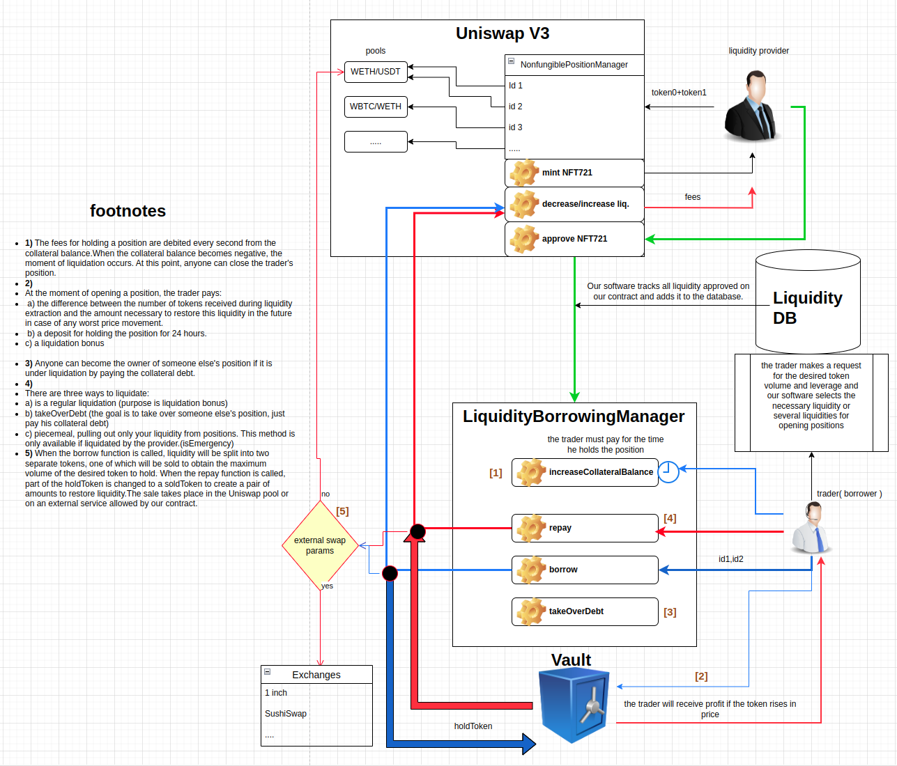

# wagmi-leverage

## Installation
```bash
git clone --recursive https://github.com/RealWagmi/wagmi-leverage.git
npm install
mv .env_example .env
npm run compile
npm run test:all
```


Wagmi Leverage is a leverage product, built on concentrated liquidity without a price-based liquidation or price oracles. This system caters to liquidity providers and traders(borrowers). The trader pays for the time to hold the position as long as he wants as long as interest is paid.

### Liquidity Providers (LPs): 
Wagmi enhances yields for V3 liquidity providers by offsetting impermanent loss. LPs can earn yield even when their liquidity position is out of range. When not utilized for trading, their liquidity position is lent to traders/borrowers, earning them higher yields through premiums and trading fees​​.

### Traders: 
Traders on Wagmi can margin long or short any pair without the risk of forced price-based liquidations. Even if their position is underwater, they are only required to pay premiums to LPs to maintain their position. This model gives traders access to high leverage on every asset and eliminates the concern of forced liquidations​​.


## Dev docs
### LiquidityBorrowingManager [](./docs/LiquidityBorrowingManager.md)

## Deployed

### V1.5

| Network | ChainId | Contract | Address |
|------| ------- | -----| -----|
| METIS | 1088 | LightQuoterV3 | [0x5A9fd95e3f865d416bb77b49d1Cca8109FcAbfE5](https://explorer.metis.io/address/0x5A9fd95e3f865d416bb77b49d1Cca8109FcAbfE5) |

##


| V3 | Network | ChainId | Contract | Address |
|------|------| ------- | -----| -----|
| Wagmi | METIS | 1088 | LiquidityBorrowingManager | [0x20fa274D00fF4917A13cD464FDbB200475B6EaBd](https://explorer.metis.io/address/0x20fa274D00fF4917A13cD464FDbB200475B6EaBd) |
| Wagmi | METIS | 1088 | Vault| [0x5e0e38F49c89D2535D12459a3Cab40dB6D2f7fC9](https://explorer.metis.io/address/0x5e0e38F49c89D2535D12459a3Cab40dB6D2f7fC9) |
| Wagmi | METIS | 1088 | PositionEffectivityChart| [0xbbF979671b95fB27Ab19d817Fc41E6F51D4a9Bf9](https://explorer.metis.io/address/0xbbF979671b95fB27Ab19d817Fc41E6F51D4a9Bf9) |

##

### V2.0 beta

| indx | Protocol | Network | supported |
|------| ------- | -----| -----|
| 1 | uniswap | ARBITRUM | ✅ |
| 2 | aave | ARBITRUM | ✅ |

##

| Network | V3 | dexIndex |
|------| ------- | -----|
| ARBITRUM | uniswap | 0 |
| ARBITRUM | sushi | 1 |

##

| Network | ChainId | Contract | Address |
|------| ------- | -----| -----|
| ARBITRUM | 42161 | LightQuoterV3 | [0xf88199222a1A734398cF55469Ba19B21d70BA4c7](https://arbiscan.io/address/0xf88199222a1A734398cF55469Ba19B21d70BA4c7) |
| ARBITRUM | 42161 | FlashLoanAggregator | [0xB81f4edA702eB09959477Afa22e71b05e33F2E21](https://arbiscan.io/address/0xB81f4edA702eB09959477Afa22e71b05e33F2E21) |
##

| V3 | Network | ChainId | Contract | Address |
|------|------| ------- | -----| -----|
| Uniswap | ARBITRUM | 42161 | LiquidityBorrowingManager | [0x37526F5302A47f6527bE7Eea62B131A773979151](https://arbiscan.io/address/0x37526F5302A47f6527bE7Eea62B131A773979151) |
| Uniswap | ARBITRUM | 42161 | Vault| [0xb45e7ECD9310cCe1f21c2993BdC29498A862Fa5E](https://arbiscan.io/address/0xb45e7ECD9310cCe1f21c2993BdC29498A862Fa5E) |
| Uniswap | ARBITRUM | 42161 | PositionEffectivityChart| [0x6Aa98EAD889D8B78C8E369D5139Abd4A720eBE89](https://arbiscan.io/address/0x6Aa98EAD889D8B78C8E369D5139Abd4A720eBE89) |


##



## Licensing

The primary license for Wagmi Concentrator(Multipool) is the [WAGMI] Source Available License 1.0 (`SAL-1.0`), see [`LICENSE`](./LICENSE.md). However, some files are licensed under `GPL-2.0-or-later` or `MIT`.